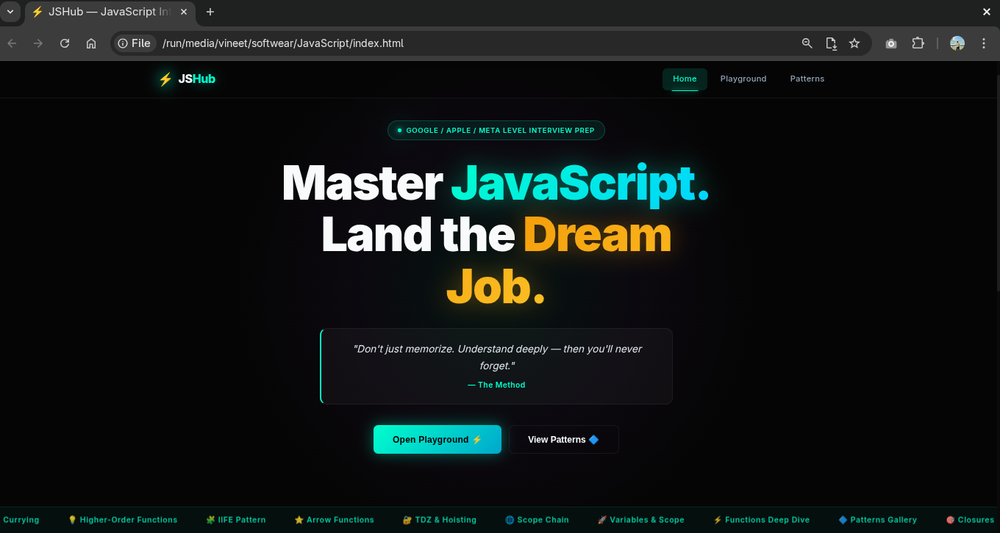
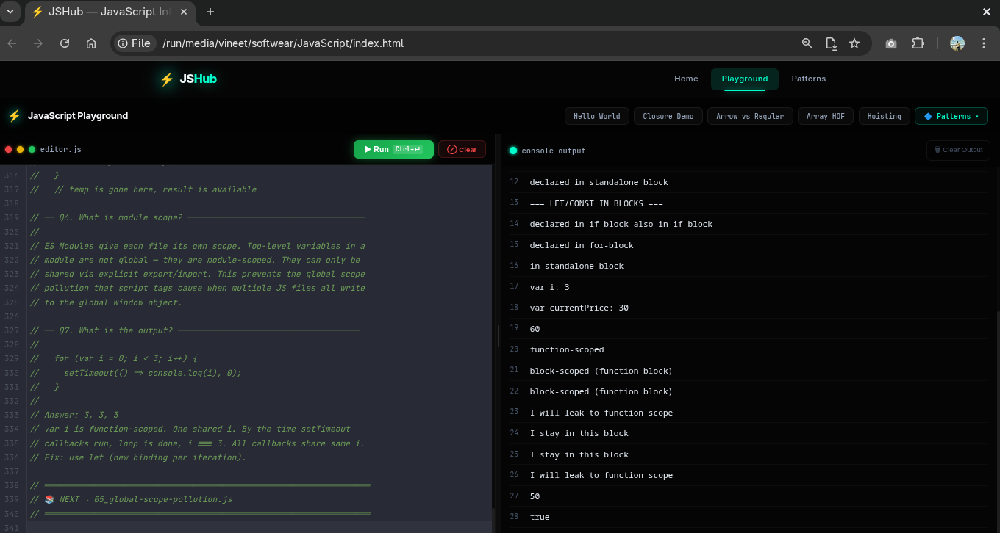
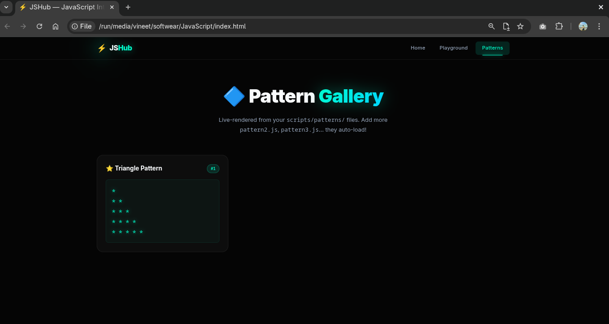

# JSHub — JavaScript Interview Prep

A structured, hands-on JavaScript study environment built as a local web app. Deep-dive topics from junior to Google/Apple senior level, a live code playground, and a visual pattern gallery — all running in your browser, no server required.

> **Level:** Junior → Google / Apple / Meta Senior

---

## Screenshots

### Home


### Playground


### Pattern Gallery


> **To add screenshots:** save your browser screenshots as `docs/screenshots/home.png`, `playground.png`, and `patterns.png`.

---

## The Web App (`index.html`)

Open `index.html` directly in Chrome or Edge — no build step, no server needed.

```
file:///path/to/JavaScript/index.html
```

Three views, navigated from the top bar:

### Home
Landing page with module overview, animated stats, and feature cards. Shows what each module covers and links you straight to the Playground or Patterns.

### Playground
A full code editor (CodeMirror with VS Code Dark+ syntax highlighting) with a live console output panel.

**Features:**
- Draggable resizer between editor and output
- `Ctrl+Enter` to run code
- Console output captured with line numbers and color-coded by type (log / warn / error / info)
- 5 built-in snippet buttons: Hello World, Closure Demo, Arrow vs Regular, Array HOF, Hoisting

**Pattern Integration (new):**

The `🔷 Patterns ▾` button in the Playground header gives you full read/write access to your `scripts/patterns/` files:

| Action | How |
|--------|-----|
| Load existing pattern | Click `🔷 Patterns ▾` → click any listed pattern → code loads in editor + auto-runs |
| Edit a pattern | Modify code in editor → press `💾 Save Pattern` or `Ctrl+S` |
| Create new pattern | Click `＋ New Pattern` → auto-incremented filename (pattern2.js, pattern3.js…) → edit → save |
| Validation | Code is validated before saving — must return `{ title, output }` with no errors |
| Error feedback | If code errors or returns wrong shape, save is blocked and the error is shown |

On first use the browser will ask for folder access — navigate to and select your `scripts/patterns/` folder. That permission persists for the session.

> **Browser requirement:** Chrome or Edge 86+. Firefox does not support the File System Access API.

### Pattern Gallery
Auto-loads all `scripts/patterns/pattern1.js`, `pattern2.js`, … and renders each one as a glowing card showing the title and output. Add or edit patterns via the Playground and they'll appear here on the next visit to Patterns.

---

## Learning Modules (`learning/`)

All course content lives in the `learning/` folder. Two modules so far, more coming.

```
learning/
├── 01_variables-and-scope/
│   ├── 01_var-vs-let-vs-const.js
│   ├── 02_hoisting.js
│   ├── 03_temporal-dead-zone.js
│   ├── 04_block-vs-function-scope.js
│   ├── 05_global-scope-pollution.js
│   ├── 06_variable-shadowing.js
│   ├── 07_lexical-scoping.js
│   ├── 08_scope-chain.js
│   └── 09_closures.js
└── 02_functions-deep-dive/
    ├── 01_declaration-vs-expression.js
    ├── 02_arrow-vs-regular-function.js
    ├── 03_iife-pattern.js
    ├── 04_higher-order-functions.js
    ├── 05_pure-functions.js
    ├── 06_first-class-functions.js
    ├── 07_currying.js
    ├── 08_partial-application.js
    ├── 09_function-composition.js
    ├── 10_default-parameters.js
    ├── 11_rest-and-spread.js
    └── 12_arguments-object.js
```

### Module 1 — Variables & Scope

| # | Topic | Key Concepts |
|---|-------|--------------|
| 01 | var vs let vs const | Declaration keywords, reassignment rules, `const` ≠ immutable |
| 02 | Hoisting | `var` hoisting vs `let`/`const` behavior, function hoisting |
| 03 | Temporal Dead Zone | TDZ mechanics, why it exists, common pitfalls |
| 04 | Block vs Function Scope | How `{}` creates scope boundaries |
| 05 | Global Scope Pollution | Why globals are dangerous, how to avoid them |
| 06 | Variable Shadowing | Inner vs outer scope naming conflicts |
| 07 | Lexical Scoping | How JS resolves variables at author-time |
| 08 | Scope Chain | How the engine walks up the chain to resolve names |
| 09 | Closures | The most powerful (and most asked) scope concept |

### Module 2 — Functions Deep Dive

| # | Topic | Key Concepts |
|---|-------|--------------|
| 01 | Declaration vs Expression | 3 ways to define functions, hoisting differences |
| 02 | Arrow vs Regular Function | `this` binding, `arguments`, use-case rules |
| 03 | IIFE Pattern | Immediately Invoked Function Expressions, module pattern |
| 04 | Higher-Order Functions | Functions that accept/return functions |
| 05 | Pure Functions | No side effects, same input → same output |
| 06 | First-Class Functions | Functions as values, callbacks, stored in data structures |
| 07 | Currying | Transforming multi-arg into single-arg chains |
| 08 | Partial Application | Pre-filling arguments for reuse |
| 09 | Function Composition | Combining small functions into pipelines |
| 10 | Default Parameters | ES6 defaults, expressions as defaults, gotchas |
| 11 | Rest & Spread | `...` in parameters vs arguments |
| 12 | Arguments Object | Legacy `arguments`, why rest params are better |

### How to study a file

Every `.js` file in `learning/` follows a consistent format:
- **Header** — topic name, level, what you'll master
- **Concept sections** — progressively deeper explanations with runnable code
- **Interview questions** — with model answers at the end

**Study method:**
1. Read the comments first — each file is a mini-lesson
2. Predict the output of each snippet before running it
3. Copy the code into the Playground to run it and experiment
4. Modify and break things — change values, remove keywords, observe what changes

---

## How to Add a Pattern

**Option A — via Playground (recommended):**
1. Open the Playground
2. Click `🔷 Patterns ▾` → `＋ New Pattern`
3. Grant folder access when prompted (select `scripts/patterns/`)
4. Edit the template — set `title` and write your pattern logic
5. Press `💾 Save Pattern` — validation runs, file is saved automatically

**Option B — manually:**

Create `scripts/patterns/pattern2.js` (increment the number):

```js
window.patterns.push(function () {
  let output = "";

  // your logic here
  for (let i = 5; i >= 1; i--) {
    output += "* ".repeat(i) + "\n";
  }

  return {
    title: "Inverted Triangle",
    output: output
  };
});
```

The Patterns page auto-loads all `pattern1.js`, `pattern2.js`, … files in order.

---

## Repository Structure

```
JavaScript/
├── index.html                        # The web app — open this in Chrome/Edge
├── css/
│   └── style.css                     # Design system (dark neon, glassmorphism)
├── scripts/
│   ├── router.js                     # View navigation
│   ├── home.js                       # Home page view
│   ├── playground.js                 # Playground + pattern editor
│   ├── patterns-view.js              # Pattern gallery view
│   └── patterns/
│       ├── pattern1.js               # Triangle pattern (example)
│       └── pattern2.js, ...          # Your patterns (add more here)
├── learning/
│   ├── 01_variables-and-scope/       # Module 1 — 9 deep-dive files
│   └── 02_functions-deep-dive/       # Module 2 — 12 deep-dive files
└── docs/
    └── screenshots/                  # App screenshots for this README
```

---

## Running in Node.js

The learning files can also be run directly in Node:

```bash
node "learning/01_variables-and-scope/01_var-vs-let-vs-const.js"
node "learning/02_functions-deep-dive/07_currying.js"
```

---

## License

Open for learning. Use it, share it, build on it.
